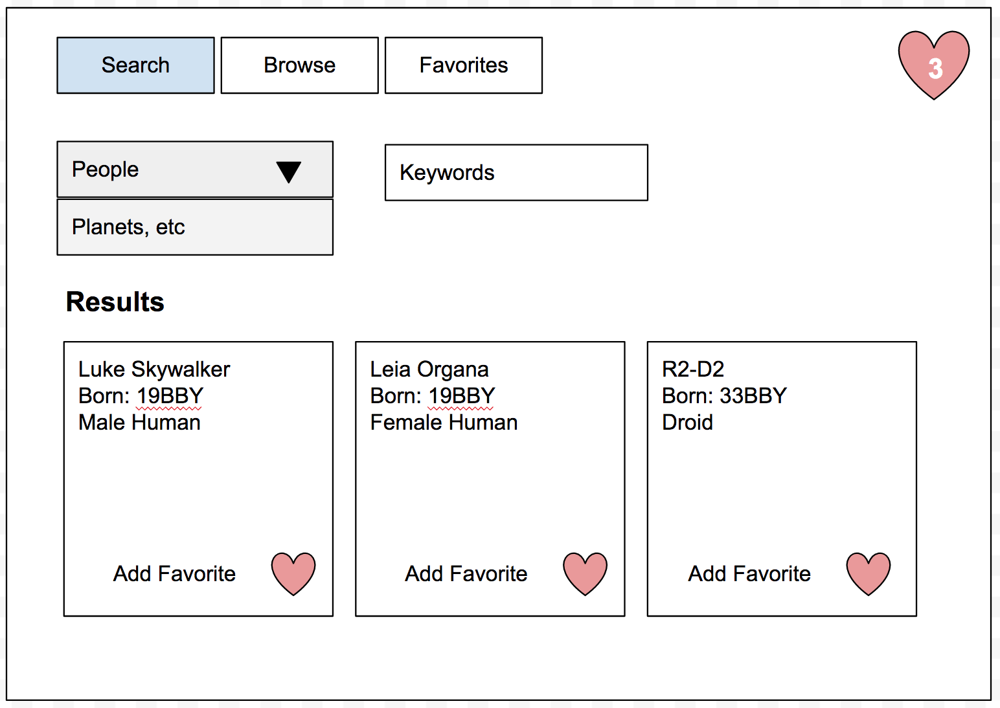
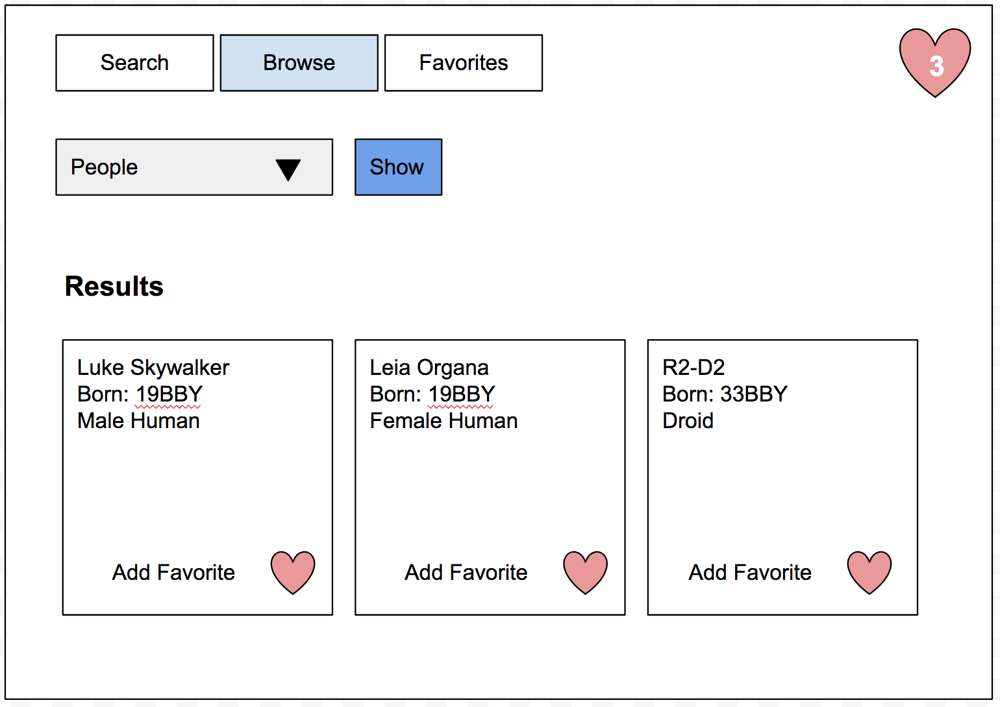
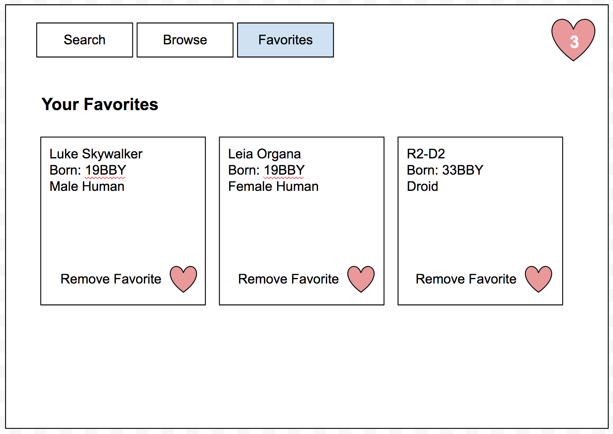

# MEAN Star Wars API Interface

A common task in dealing with data from an API is to create a user-friendly interface to access and find information. This weekend that's exactly what we'll be doing with a MEAN stack application.

## Base Application

Your app will have 3 views, though you can divide this up further if you wish. Use client-side routing (ngRoute), views, controllers, and a service. Angular Material would be awesome but not required. You should spend time to style your application, however.

Users will be able to find and browse SWAPI resources. 

They will be also be able to Favorite any resource they want. These favorites will need to be stored in your Mongo database. **You'll need to determine how much information to store in your database keeping in mind you can always get the data again from the API.**

### Links

Each resource tends to have a lot of URLs to other SWAPI resources as values. You can choose to display these as links to the SWAPI site if you want.

### Search View

Allow the user to choose which kind of resource (people, planets, etc) and to enter a keyword. Display the results in a meaningful way. Allow the user to Favorite any of the resources and save it to your database.

### Browse View

Allow a user to click on buttons to load and see resources of the various types. Note that SWAPI base results are paginiated. You can ignore multiple pages for Base Mode.

### Favorites View

Display the user's Favorites in a meaningful way. The view should display information from the API. The user should be able to remove Favorites from this view.

## Hard Mode Options

- Pictures! When a user clicks on a single Favorite, go get a Giphy image for that resource and show it on the DOM.
- Support the pagination provided by the SWAPI results.

## Pro Mode

Allow users to add comments or notes to each Favorite in the database. This can be done in a number of ways. 

If you feel adventurous, you can explore `sub-documents`. [Here is a repo with some examples of how to use them.](https://github.com/PrimeAcademy/mongoose-subdocs). 

