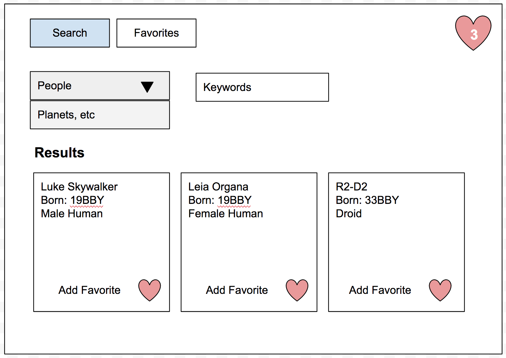
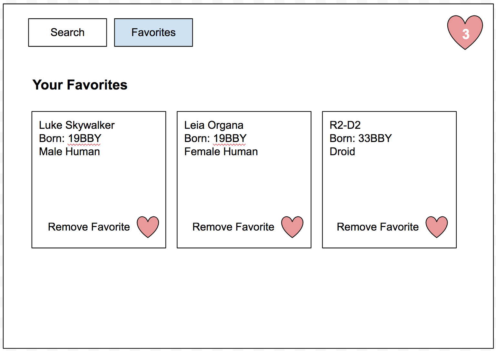

# MEAN Star Wars API Interface

A common task in dealing with data from an API is to create a user-friendly interface to access and find information. This weekend that's exactly what we'll be doing with a MEAN stack application.

## Base Application

Your app will have... 
- [x] 2 views

Use client-side...
- [x] index.html
- [x] nav.html for views
- [x] client.js
- [x] routing (ngRoute)
    - [x] favorites-router.js
- [x] views
    - [x] favorites.html
    - [x] search.html
- [x] controllers
    - [x] favorites-controller.js
    - [x] search-controller.js
- [x] service
    - [x] swapi-service.js
- [x] Angular Material would be awesome but not required
- [x] style your application
    - [x] main.css
- [x] Users will be able to find and favorite SWAPI resources.
- [x] They will be also be able to Favorite any resource they want 
- [x] These favorites will need to be stored in your Mongo database through Mongoose. **You'll need to determine how much information to store in your database keeping in mind you can always get the data again from the API.**

### Links

Each resource tends to have a lot of URLs to other SWAPI resources as values. You can choose to display these as links to the SWAPI site if you want.

### Search View

- [x] Allow the user to choose which kind of resource...
    - [x] people 
    - [x] planets 
    - [x] etc 
    - [x] enter a keyword search 
- [x] Display the results in a meaningful way
- [x] Allow the user to Favorite any of the resources and save it to your database. Note that SWAPI search results can be paginiated. You can ignore multiple pages for Base Mode.

### Favorites View

- [x] Display the user's Favorites in a meaningful way
    - [x] The view should display information from the API
    - [x] The user should be able to remove Favorites from this view.

